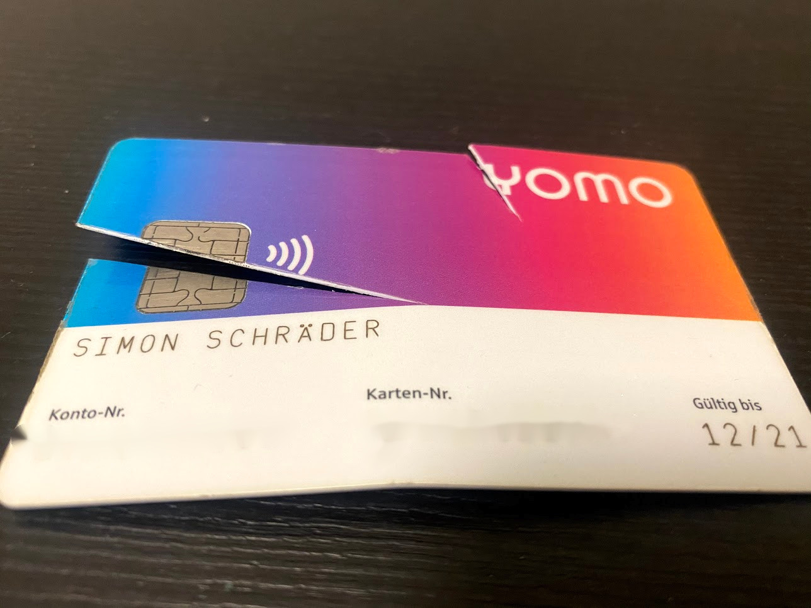

Mitte 2016 war durchgesickert, dass einige Sparkassen zusammen ein App-basiertes Girokontoprodukt planen.
Das Bundeskartellamt hatte man sicherheitshalber eingeschaltet, das dem ganzen [grünes Licht](https://www.bundeskartellamt.de/SharedDocs/Meldung/DE/Pressemitteilungen/2016/14_09_2016_Sparkasse_App.html) erteilte.
Number26 als innovatives Banking-Startup hatte sich gerade erst zu N26 rebranded und war auf dem Weg zur eigenen Banklizenz, zu dem Zeitpunkt setzte man noch auf die Wirecard Bank.
So schien die Sorge der Sparkassen, dass man viele junge Kunden verlieren könnte. Zum einen an Neobanken wie N26, aber sicher auch an Direktbanken wie die DKB.

Man einigte sich auf die grundlegenden Konditionen: Das Konto selber mit Karte sollte kostenlos sein, ebenso Abhebungen im Sparkassennetz, Überweisungen und Lastschriften ebenfalls. Die Karte kam im einheitlichen bunten Design, die App genauso. Der Rest wie ATM-Gebühren im Ausland wurden den einzelnen Sparkassen überlassen. Einzelne Sparkassen boten einen Dispo von 500€ an, andere nicht. Der Vergleich erfolgte innerhalb der App durch Studieren von seitenlangen PLV.

In [Juli 2017](https://www.handelsblatt.com/finanzen/banken-versicherungen/fintechs-smartphone-konto-der-sparkassen-startet-jetzt/19993016.html) erfolgte der gesamte Launch, etwa 12 Sparkassen der etwa 385 waren dabei.

Beim Videoident war ausschließlich ein deutscher Perso zugelassen, bei Neuinstallation war ein erneutes Videoident mit den gleichen Kriterien und akribischer Kontrolle der Adresse auf dem Ausweis notwendig.

Einzelne Sparkassen vertickten ihre Standard-Kreditkarte im yomo-Design, aber das hing sehr von der Sparkasse ab.

Irgendwann um 2019 folgte die erste Innovation: Statt Freigabe der Überweisungen in der kunterbunten yomo mit einer 4-stelligen PIN, musste ab dann zur höheren Sicherheit eine 5-stellige PIN genutzt werden. Krass.

Schlussendlich war es das dann auch an Innovationen, Apple Pay mit der girocard oder Mobiles Bezahlen auf Android? Nein. Ersatzkarte bestellen ohne Telefonanruf? Nein. SEPA Instant? Nope. TAN-freie Überweisungen? Nope. Paydirekt? Nein. Instant Issuing der Karte in-App für Mobile Payment? Auch nicht. 

Anfang des Jahres wurde die Vermarktung für Neukunden eingestellt, nun flattern die Briefe an Bestandskunden raus: Das Konto wird eingestellt, die Konten werden gekündigt. Die Sparkasse Paderborn-Detmold beispielsweise bietet an, das Konto in ein anderes Kontomodell zu überführen, statt 0€ kostet es dann 8,50€ im Monat. Attraktiv ist wohl anders.

Am Ende des Tages war es ein Experiment der Sparkassen, das vermutlich auch an den internen Germien und Abstimmungen gescheitert ist. Dabei wäre es so stark, wenn die Sparkassen bundesweit es hinbekommen würden, ein einheitliches Kontomodell inkl. aller Buchungsposten, einer Debitkarte und einer Kreditkarte zu einem monatlichen Festpreis hinzubekommen, es muss ja nicht mal 0€ sein. Aber wen sprechen die Sparkassen an, wenn man erst lange die PLV studieren muss, um ein attraktives Konto zu finden, was je nach Sparkasse komplett unterschiedlich benannt ist? Einige Sparkassen pushen ja vor allem noch Modelle mit Einzelbepreisung, sodass Kartenzahlungen einzeln mit Kosten berechnet werden, in Corona-Zeiten ein großes Ärgernis.

Der Wille für Einheitlichkeit ist wohl nicht da, so scheitert dann wie hier yomo an der Koordination. Die junge Kunden verliert man am Ende so.