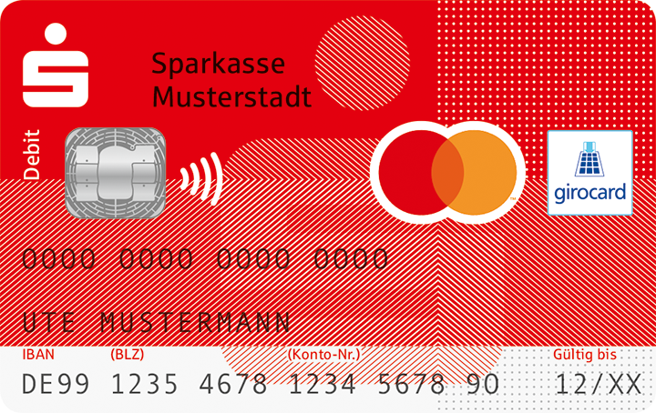

Nach der kleinen Ankündigung durch die Finanz-Informatik im Frühjahr diesen Jahres haben die Sparkassen nun mit der Kundenkommunikation begonnen.
Unter https://jetztallesmoeglich.de werden die Vorteile der girocard mit Debit Mastercard Cobadge beschrieben, Online-Shopping jetzt auch direkt mit der Debitkarte zum Konto.
Ist es das Ende von Banken wie N26 und Revolut mit ihren soliden DMC?
Zeit, sich die Konditionen der 4 auf der Webseite bekannten Sparkassen anzuschauen.

Leider ist das ganze dann doch nicht so leicht wie gedacht. Die Sparkassen selber haben den Launch noch nicht bekanntgegeben, die PLV sind noch nicht aktualisiert. Einige nicht-teilnehmenden Sparkassen waren da schneller und haben schon vor Monaten in ihr PLV explizit geschrieben, dass sie nur ein Maestro-Cobadge anbieten und kein Mastercard.

Man kann also nur spekulieren, wie die Preise im Einsatz aussehen, sie werden sich wohl irgendwo zwischen Maestro und KK befinden:

|                  | Siegen                                       | Ospa                                            | Westmünsterland                         | Oberlausitz                        |
|------------------|----------------------------------------------|-------------------------------------------------|-----------------------------------------|------------------------------------|
| Kontogebühr      | 6€                                           | 6,99€                                           | 9€                                      | 7,90€                              |
| AEE              | GC: 1%, mind 1€, max. 4€ KK: 1%              | 2%                                              | GC: 1%, mind 0.77€, max. 3,83€ KK: 1.5% | GC: 1%, mind 1€, max 4€ KK: 1.5%   |
| ATM €            | GC: 1%, mind. 2.5€, max. 4€ KK: 2%, mind 6€  | GC: 7,50€ KK: 2%, mind. 5,11€                   | GC: 4,50€ KK: 0€                        | GC: 1%, mind 6€ KK: 2%, mind 5€/0€ |
| ATM Fremdwährung | GC: 1%, mind. 2.5€, max. 4€ KK: 2%, mind. 6€ | GC: 7,50€ + 2% AEE KK: 2%, mind. 5,11€ + 2% AEE | GC: 4,50€ KK: 1.5%                      | GC: 1%, mind 6€  KK: 1.5%          |

Teils gibt es keine Einsteiger-Kreditkarte, sondern nur die Gold-KK mit günstigen Abhebungen.

In Siegen ist der Auslandseinsatz der Debitkarte mit mindestens 1€ Gebühren punitiv teuer, in der Oberlausitz zahlt man die gleichen Gebühren.

Bei der Sparkasse Westmünsterland scheint man die Preise seit der DM-Umstellung nicht angefasst zu haben, eine Zahlung kostet 1%, aber mindestens 1,5DM (0,77€), maximal 7,5DM (3.83€).

Einzig bei der Ospa nimmt man "günstige" 2% für die Fremdwährung.

Sollte man die Bepreisung nicht ändern, dürfte das mit dem Einsatz zum Online-Shopping und weltweiten zahlen dann doch eher abschreckend sein. Selbst DCC dürfte beim Kauf von kleinen Artikeln beispielsweise auf AliExpress günstiger sein. Man kann nur hoffen, dass die Sparkassen ein solides Produkt nicht durch die Preisgestaltung kaputtmachen.

